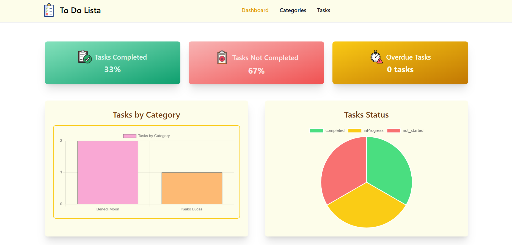
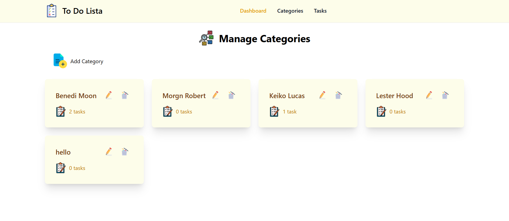
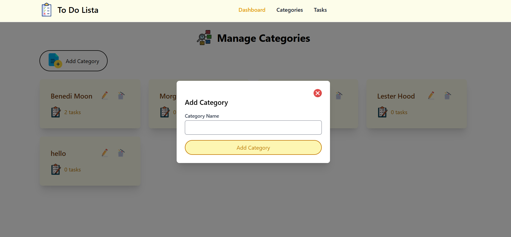
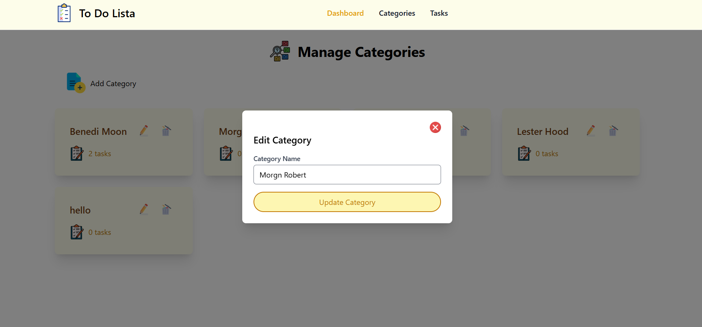
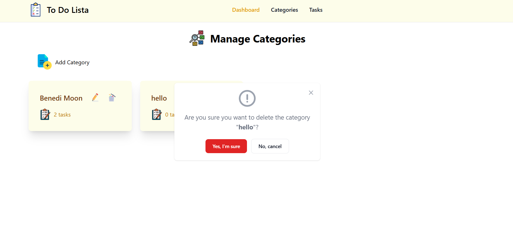
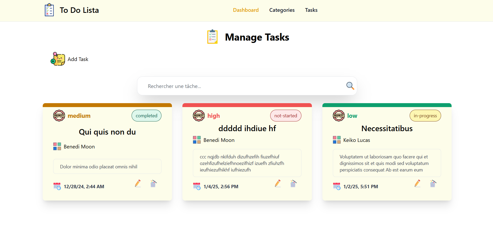
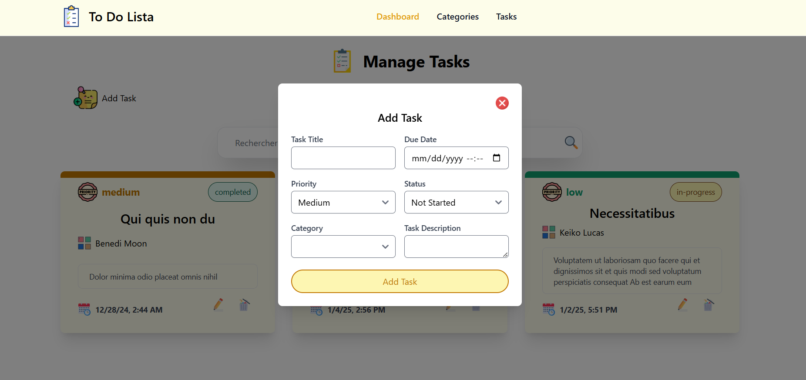
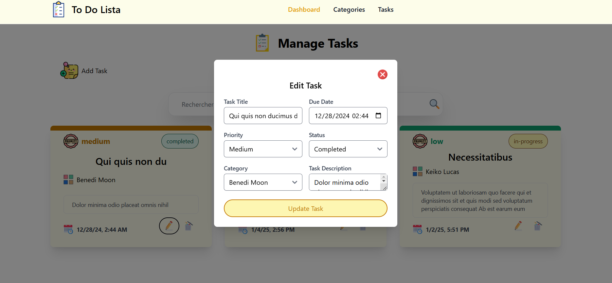
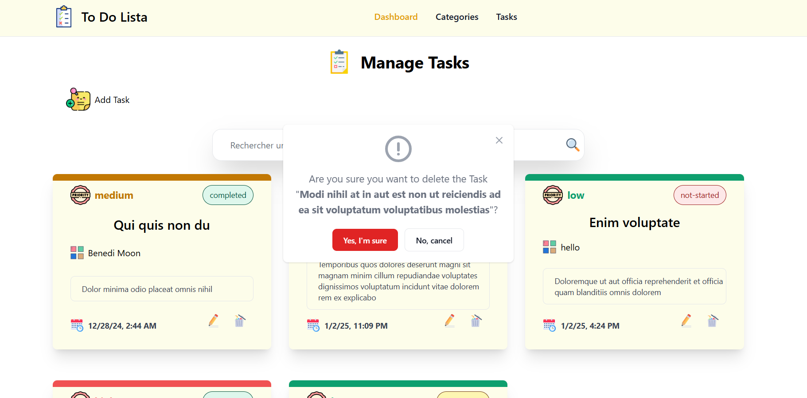
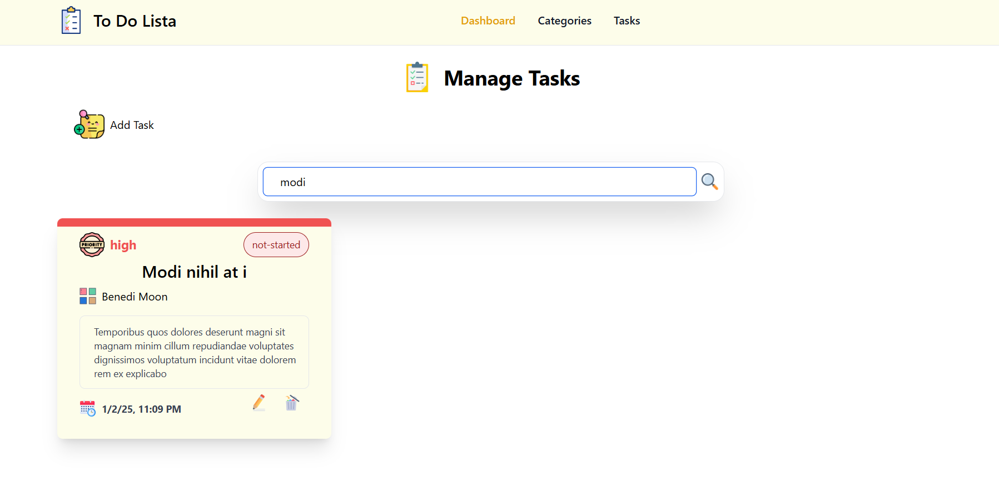

# 🌟 ToDoList App - Task Management Made Simple and Powerful 🌟

## 📚 **Project Overview**

This is a customizable and efficient ToDoList application designed for users to manage their tasks effortlessly. With real-time search, task categorization, and an interactive statistics dashboard, this app empowers users to stay on top of their personal and professional goals. Built with **Angular 17**, the application follows a modular, reactive, and best-practice-driven approach to frontend development.

---

## 💻 **Features**

### 🔹 **Task Management**
- Create, edit, and delete tasks easily.
- Tasks contain:
  - **Title**
  - **Optional description**
  - **Due date** with time (European format)
  - **Priority level**: High, Medium, Low
  - **Completion status**: Not Started, In Progress, Completed

### 🔹 **Category Management**
- Users can create, modify, and delete categories such as **Work**, **Personal**, **Shopping**, etc.
- Tasks are assigned to one unique category.

### 🔹 **Real-time Search**
- A search bar that helps users quickly find tasks by **title** or **description**.

### 🔹 **Statistics Dashboard**
- A dynamic dashboard showing key task stats:
  - Percentage of **completed tasks**
  - Percentage of **incomplete tasks**
  - Number of **overdue tasks** (tasks with expired due dates)

### 🔹 **Responsive Interface**
- Intuitive and mobile-friendly design, adapting seamlessly to **desktop** and **mobile devices**.

---

## 🛠 **Technical Features & Architecture**

### **Angular 17**
- **Component-based architecture** for building a modular and scalable app.
- **Reactive programming** with **Observables** to handle data flow.
- **Services** to manage communication between components.
- **Routing** for seamless navigation between task views.
- **Forms handling** for task creation and modification.
- **Data binding** to synchronize data with the UI.
- **Pipes** to format display values like dates and filters.

---

## 🎨 **UI Design**

The user interface has been designed for simplicity and efficiency. Using **Figma** or **Adobe XD**, the following design principles have been applied:
- **Clean and modern layout** for task management.
- **Interactive and dynamic dashboard** for task statistics.
- **User-friendly forms** for task creation and modification.
- **Responsive design** with **Bootstrap** or **Tailwind CSS** for fast UI development.

---

## 🔒 **Validations**

To ensure a smooth user experience, the following validations have been added:
- **No tasks can have due dates in the past**.
- **Maximum length validations** for task titles and descriptions.
- **Prevention of duplicate categories**.

---

## 🏗️ **Technologies Used**

- **Frontend**: 
  - **Angular 17**
  - **TypeScript**
  - **SCSS** for styling
  - **Tailwind CSS** or **Bootstrap**
  
- **Core Concepts**: 
  - **Components**: Structuring task list, forms, dashboard.
  - **Modules**: Organizing the application code.
  - **Services**: Facilitating communication between components.
  - **Routing**: For navigating views in the app.
  - **Form Handling**: For creating and editing tasks.
  - **Observables**: Managing data flow and real-time updates.
  - **Data Binding**: Synchronizing task data with the UI.
  - **Pipes**: Formatting data like dates.

---

## 📊 **Getting Started**

Follow these steps to set up the project on your local machine:

### 1. **Clone the repository**

```bash
git clone https://github.com/Douaesb/todo-list-app.git
cd todo-list-app
```

### 2. **Install dependencies**

```bash
npm install
```

### 3. **Start the development server**

```bash
ng serve
```

Navigate to `http://localhost:4200` to start using the app!

---

## 💡 **Future Enhancements**
- User authentication for personalized task management.
- Cloud syncing for tasks and categories across devices.
- Integration with **Google Calendar** or other task management tools.

---

## 📝 **Contributing**

We welcome contributions to improve this project! To contribute, follow these steps:
1. Fork the repository.
2. Create a new branch (`git checkout -b feature-name`).
3. Make your changes and commit them (`git commit -am 'Add feature'`).
4. Push to your branch (`git push origin feature-name`).
5. Open a pull request!

---

## 📱 **Screenshots**

Here's a preview of the app:

**Statistics Dashboard**:




**Category Management**:






**Task Management**:








---

## 💬 **License**

This project is licensed under the MIT License - see the [LICENSE](LICENSE) file for details.

---

### 🚀 **Ready to get started?**
Enjoy task management like never before with our customizable, efficient ToDoList app! 🌟
